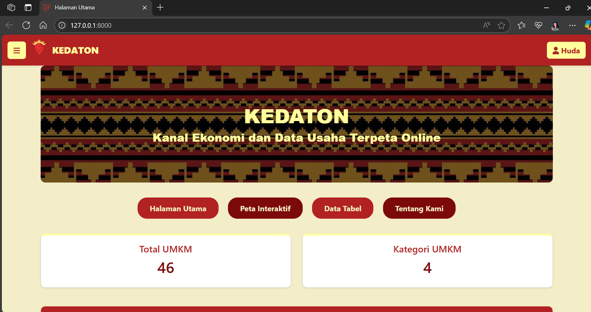
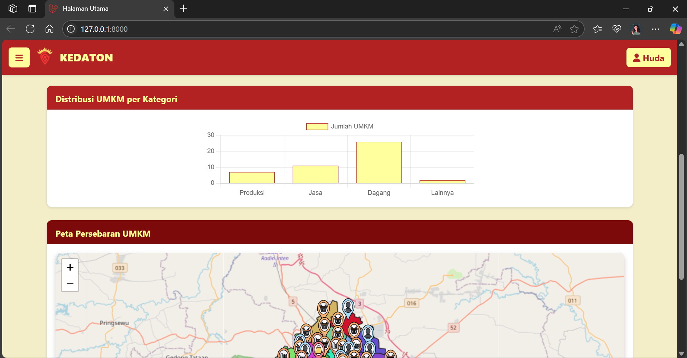
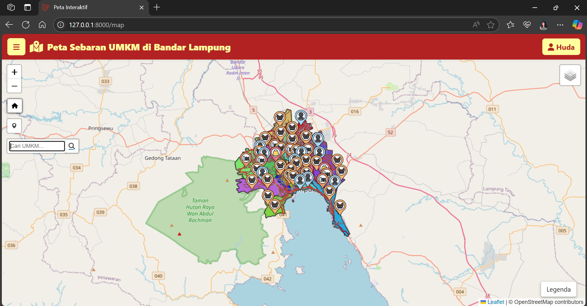
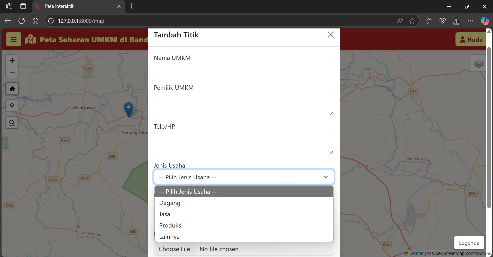
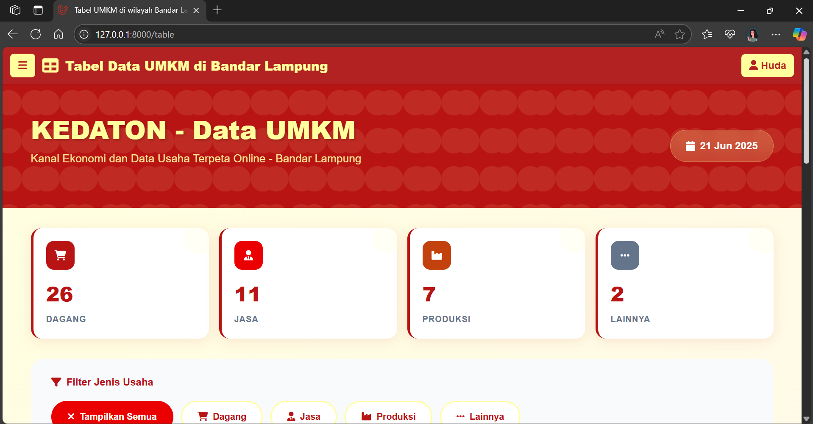
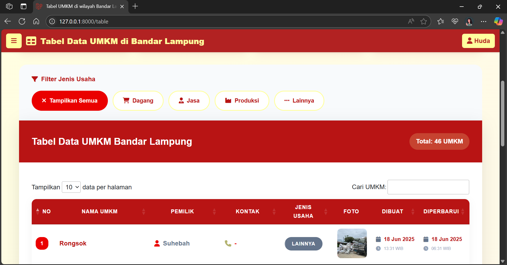
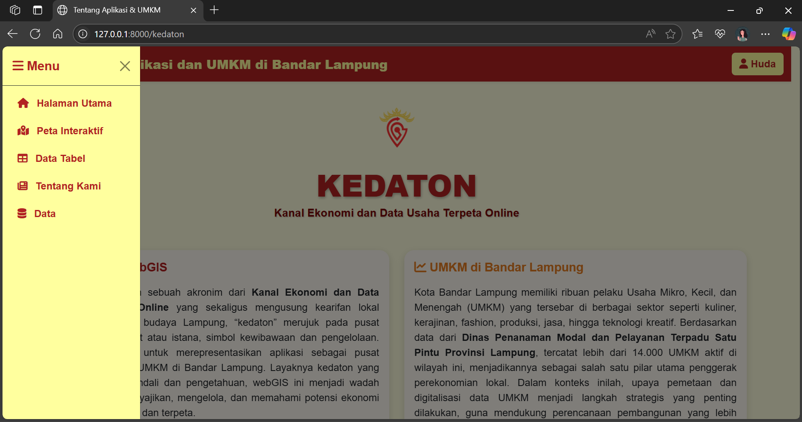

# KEDATON - Kanal Ekonomi dan Data Usaha Terpeta Online
Kedaton atau "Kanal Ekonomi dan Data Usaha Terpeta Online" merupakan salah satu webGIS ynag dapat digunakan untuk menyajikan informasi spasial UMKM di Kota Bandar Lampung. Kata "kedaton" tersebut mengusung kearifan lokal Lampung, di mana "kedaton" berarti pusat pemerintahan adat atau istana. Nama ini dipilih untuk merepresentasikan aplikasi sebagai pusat informasi spasial UMKM di Bandar Lampung. Layaknya Kedaton yang menjadi pusat kendali dan pengetahuan, webGIS ini menjadi wadah utama dalam menyajikan, mengelola, dan memahami potensi ekonomi lokal secara digital dan terpeta.

>**Tujuan Pembuatan Website**
>
> Website diciptakan agar, meningkatkan keterbukaan data UMKM di Kota Bandar Lampung, menyediakan visualisasi spasial dari data UMKM yang ada, serta mendukung proses perencanaan ekonomi berbasis wilayah. Dengan demikian, website ini diharapkan dapat menjadi alat bantu yang efektif bagi masyarakat, pelaku usaha, maupun pemerintah dalam memahami dan memanfaatkan potensi ekonomi lokal secara digital.

>**Komponen Pembangun**
>
>Website ini dikembangkan menggunakan framework Laravel dan mengusung teknologi Sistem Informasi Geospasial sebagai komponen utama. Penggunaan GeoServer dilakukan dalam pengambilan data Batas Administrasi dan Jaringan Jalan untuk dapat ditampilkan pada halaman peta. Selain itu, penggunaan berbagai macam library ditambahkan pada website tersebut, seperti Leaflet.JS, Leaflet Draw, jQuery, Transformer WKT, dan lain sebagainya. Berbagai fitur unggulan disematkan di dalamnya, antara lain peta interaktif lokasi UMKM, kemampuan untuk menambahkan titik lokasi secara langsung di peta, serta dashboard dinamis yang menyajikan grafik dan statistik secara real-time. Selain itu, tersedia juga tabel data lengkap yang memuat informasi rinci setiap UMKM, serta fitur pencarian, penggantian tampilan basemap, dan legenda kategori yang interaktif, sehingga menjadikan website ini informatif dan mudah digunakan oleh berbagai kalangan.

>**Sumber Data**
>
>Dinas Penanaman Modal dan Pelayanan Terpadu Satu Pintu (DPMPTS) Provinsi Lampung
[https://dpmptsp.lampungprov.go.id/](https://dpmptsp.lampungprov.go.id/statis-124-umkm-bandar-lampung.html)

>**Tangkapan Layar Komponen Penting pada Website**
>
>
>
>>
>
>
>>>
